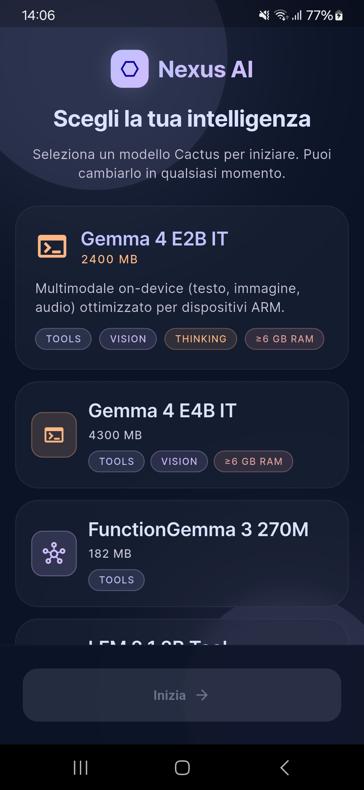
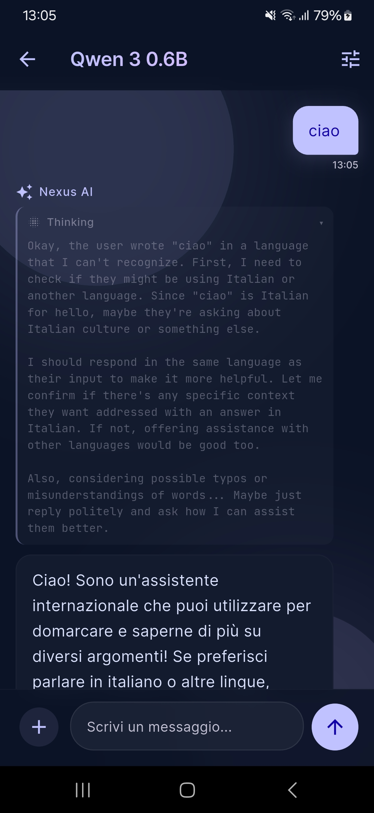

# Nexus AI (smart_chat)

A Flutter app for **on-device** LLM chat. No remote server for inference — models run locally on your phone.

Two inference engines are supported:

- **[Cactus](https://pub.dev/packages/cactus)** — dynamic catalog of lightweight models (Qwen, LFM, SmolLM, …)
- **[flutter_gemma](https://pub.dev/packages/flutter_gemma)** — Gemma 4 multimodal models (text, image, audio, thinking, native tool calling)

## Preview

| Model selection | Chat |
| :---: | :---: |
|  |  |

**Promo video** — generated with **Omni**  
[`docs/videos/promo.mp4`](docs/videos/promo.mp4)

**UI design** — prototyped with **[Stitch](https://stitch.withgoogle.com/)** · mockups in [`.stitch/llm-chat-assistant/`](.stitch/llm-chat-assistant/)

---

## Features

- Streaming chat with persistent history (ObjectBox)
- On-device model selection and download
- Configurable parameters: temperature, max tokens
- **Web search** (DuckDuckGo) via tool calling — compatible models only
- **Thinking mode** — view model reasoning (Gemma 4 models)
- CPU / GPU / NPU accelerator selection (flutter_gemma models, shown in Settings)
- Warning for heavy models on low-RAM devices

---

## Requirements

| Component | Version |
|---|---|
| Flutter (FVM) | **3.41.7** (`.fvmrc`) |
| Dart SDK | ^3.11.1 |
| Android | **arm64-v8a** (minSdk 24) |

> The APK is limited to `arm64-v8a` because flutter_gemma `.litertlm` models require ARM64.

---

## Setup

```bash
# 1. Install FVM and the project Flutter version
fvm install 3.41.7
fvm use 3.41.7

# 2. Dependencies
fvm flutter pub get

# 3. Code generation (Riverpod, ObjectBox, …)
fvm dart run build_runner build --delete-conflicting-outputs

# 4. Run on an arm64 device/emulator
fvm flutter run
```

### Release build (Android)

```bash
fvm flutter build apk --release
# Output: build/app/outputs/flutter-apk/app-release.apk
```

Install on a connected device:

```bash
adb install build/app/outputs/flutter-apk/app-release.apk
```

---

## Available models

### Cactus (remote catalog)

Downloaded from the Cactus registry on first launch. Includes lightweight, compact chat models ideal for low-RAM devices. Downloads go through `CactusLM` with cancellation support.

Some Cactus models support native tool calling (e.g. Qwen, LFM). Gemma/FunctionGemma on Cactus do **not** expose web search.

### flutter_gemma (static catalog)

Defined in `lib/data/flutter_gemma_model_catalog.dart`:

| Model | Size | Capabilities |
|---|---|---|
| Gemma 4 E2B IT | ~2.4 GB | Multimodal, thinking, tool calling, vision, audio |
| Gemma 4 E4B IT | ~4.3 GB | Same as E2B, more capable |

Downloaded from Hugging Face as `.litertlm` files. No HF token required.

---

## Web search

Enable in **Settings → Web search** (models with `supportsWebSearch` only):

| Backend | Support |
|---|---|
| flutter_gemma (Gemma 4) | ✅ native tool calling |
| Cactus (Qwen, LFM, …) | ✅ dedicated tool loop |
| Cactus (Gemma, FunctionGemma) | ❌ |

Search uses DuckDuckGo Lite (no API key).

---

## Architecture

```
lib/
├── data/              # Gemma catalog, tool definitions
├── mappers/           # DTO → domain models (Cactus, chat)
├── models/            # Domain models (LlmModel, ChatMessage, …)
├── providers/         # Riverpod (chat, models, download, history)
├── repositories/      # Cactus + Gemma catalog aggregation
├── router/            # go_router
├── screens/           # UI (model selection, chat, history, settings)
├── services/          # Inference, download, web search, device profile
├── theme/             # Lumina (dark)
├── utils/             # Thinking parser, URL resolver, throttle
└── widgets/           # Reusable components
```

### Inference flow

1. User selects a model → `chatInitializationProvider`
2. `ChatEngineInitializer` downloads (if needed) and initializes the correct backend
3. `LlmInferenceService` delegates to `CactusInferenceHandler` or `GemmaInferenceHandler`
4. The response is streamed in `ChatProvider` and saved to ObjectBox

### Backends

```dart
enum LlmBackend { cactus, flutterGemma }
```

`ChatEngineState` holds the active backend runtime handle (`CactusLM` or `InferenceModel`).

---

## Tech stack

| Area | Library |
|---|---|
| State management | hooks_riverpod, riverpod_generator |
| Routing | go_router |
| Local persistence | objectbox |
| Cactus inference | cactus |
| Gemma inference | flutter_gemma |
| Networking | dio, retrofit (Swagger-generated API) |
| Mapping | auto_mappr |
| Build tools | build_runner, fvm |

Architecture conventions are documented in [`AGENTS.md`](AGENTS.md).

---

## Tests

```bash
fvm flutter test
fvm flutter analyze lib
```

---

## Android notes

- **ProGuard/R8**: rules in `android/app/proguard-rules.pro` for MediaPipe/flutter_gemma
- **OpenCL** (GPU): optional native libraries in `AndroidManifest.xml`
- **Foreground service**: Gemma downloads >500 MB automatically use the foreground service (Android 9-minute limit)

---
